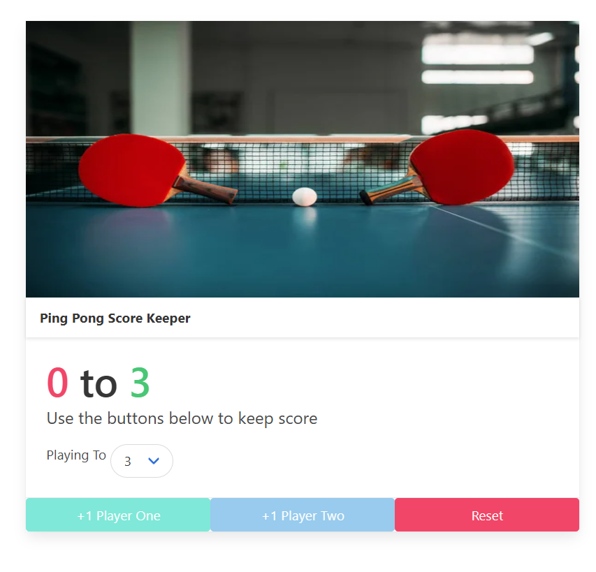

# Ping Pong Score Keeper



## Description
The **Ping Pong Score Keeper** is a simple web-based application to keep track of the score in a two-player ping pong match. It allows users to:
- Increment the score for each player.
- Select the winning score limit.
- Reset the game when necessary.

This project uses **Bulma CSS** for styling and vanilla JavaScript for interactivity.

## Features
- **Dynamic score updates:** Players' scores increase with button clicks.
- **Customizable winning score:** Choose the winning score from a dropdown menu.
- **Game reset:** Reset the game at any time.
- **Responsive design:** Built with Bulma for modern and responsive design.

## Technologies Used
- HTML
- CSS (Bulma Framework)
- JavaScript (Vanilla)

## Setup Instructions

### Prerequisites
Make sure you have the following installed:
- A web browser (like Chrome, Firefox, etc.)
- Basic knowledge of HTML/CSS/JavaScript

### How to Run the Project
1. Clone this repository to your local machine:
   ```bash
   git clone https://github.com/EmokeVagyas/score-keeper
   ```

2. Navigate to the project folder:
    ```bash
    cd score-keeper
    ```

3. Open the `index.html` file in your browser:
    - You can do this by simply double-clicking the index.html file, or by running:
    ```bash
    open index.html
    ```
    - Alternatively, use a local server (like Live Server in VSCode) to run the project.

## How to use

1. Open the Ping Pong Score Keeper in your browser.
2. Select the number of points to play to from the dropdown menu.
3. Click the +1 Player One and +1 Player Two buttons to increase the scores for each player.
4. When a player reaches the winning score, the game is over, and the scores will be displayed with colored text indicating the winner and loser.
5. Click Reset to start a new game.

# License

This project is licensed under the MIT License - see the LICENSE file for details.

# Contact

Created by Emoke Vagyas - feel free to contact me!
